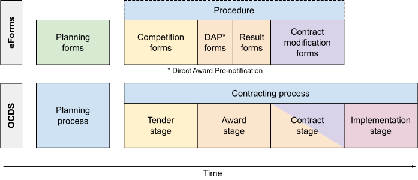
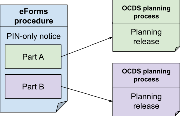
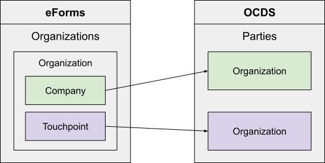
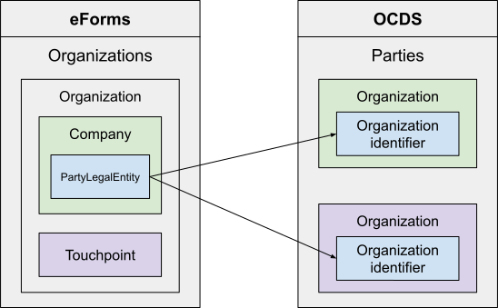
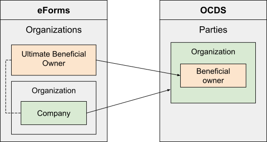

# Primer

```{attention}
If you are not yet familiar with the eForms SDK, we recommend that you start with the [eForms Developer Guide](https://docs.ted.europa.eu/eforms/latest/guide/index.html).
```

The Publications Office of the European Union created the [eForms SDK](https://docs.ted.europa.eu/eforms/latest/) to facilitate eForms implementation. While it is possible to [implement eForms without the SDK](https://docs.ted.europa.eu/eforms/latest/guide/implementing-eforms-without-the-sdk.html), the Publications Office politely describes this as requiring ["several times the effort to create and maintain."](https://docs.ted.europa.eu/eforms/latest/guide/understanding-the-sdk.html#_the_purpose_of_the_eforms_sdk) We therefore map to OCDS from the metadata-driven SDK, not directly from the UBL/XML.

The eForms SDK introduces the concept of a [field](https://docs.ted.europa.eu/eforms/latest/fields/index.html). Each field corresponds to a business term defined in the [annex to the eForms regulation](https://single-market-economy.ec.europa.eu/single-market/public-procurement/digital-procurement/eforms_en). A same business term can have many corresponding fields, for each context in which the term is used: for example, the term *Title* (BT-21) can be used in the context of a lot, lot group, or part of a Prior Information Notice.

**The [Field mappings](mapping) describe how to map each eForms SDK field to OCDS.**

## How eForms concepts are modeled in OCDS

This section explains the relationships between key concepts in eForms and OCDS, at a high level. In some cases, the relationships differ; any differences are addressed in the [field mappings](mapping). This page assumes you are familiar with the terms and concepts in the [eForms specification](https://docs.ted.europa.eu/eforms/latest/schema/index.html).

### Procedure (one or more contracting processes)

In eForms, a procedure is a “[series of actions conducted in a given sequence that leads to the conclusion of a public contract](https://docs.ted.europa.eu/eforms/latest/schema/terms-and-definitions.html).”

In OCDS, a procedure is modeled as a contracting process, which is defined as “all the actions aimed at implementing one or more contracts.” A contracting process is divided into four stages: tender, award, contract and implementation. For an introduction to contracting processes in OCDS, see [How does the OCDS work?](https://standard.open-contracting.org/latest/en/primer/how/#how-does-the-ocds-work)

In eForms, planning information is “[not associated to any Procedure](https://docs.ted.europa.eu/eforms/latest/schema/documents-forms-and-notices.html#_planning_forms),” though the buyer can define and use an internal Procedure identifier.

In OCDS, planning information is modeled as a planning process, which is defined as “all the actions aimed at planning one or more contracting processes.”

There are differences between a procedure in eForms and a contracting process in OCDS:

* In OCDS, a contracting process includes an implementation stage, covering payments, progress updates and completion information. eForms does not currently cover the implementation stage; a Contract Completion form is [planned](https://docs.ted.europa.eu/home/eforms/FAQ/index.html#_forms_and_procedures).
* In multi-stage procedures (e.g. framework agreements with reopening of competition), OCDS treats each round of competition as a separate contracting process; for more information, see [Framework agreements](https://standard.open-contracting.org/latest/en/guidance/map/framework_agreements/). eForms treats each round of competition as  occurring within the same procedure.

The following diagram illustrates the relationship between:

* Procedures in eForms and planning and contracting processes in OCDS
* [Form types](https://docs.ted.europa.eu/eforms/latest/schema/documents-forms-and-notices.html#formAndFormTypesSection) in eForms and planning and contracting process stages in OCDS



### Notice (one or more releases)

In eForms, a notice is an XML [document published by a buyer about market opportunities and results](https://docs.ted.europa.eu/eforms/latest/schema/documents-forms-and-notices.html#noticeNoticeTypesAndSubtypesSection).

In OCDS, a notice is modeled as a release – or as one or more releases, in the case of a [PIN-only notice](#part-release). A release is JSON text that describes a single contracting or planning process at a particular point in time. For an introduction to releases in OCDS, see [How is OCDS data published?](https://standard.open-contracting.org/latest/en/primer/releases_and_records/)

#### Document type (release tag)

eForms distinguishes three [document types](https://docs.ted.europa.eu/eforms/latest/schema/documents-forms-and-notices.html#documentAndDocumentTypeSection) relating to different stages of the contracting process: Prior Information Notice (PIN), Contract Notice and Contract Award Notice.

The following table describes the relationship between document types in eForms and release tags in OCDS. Release tags distinguish planning and contracting processes, and the stages of the contracting process to which a release relates.

In eForms, a PIN document is a [planning notice](https://docs.ted.europa.eu/eforms/latest/schema/documents-forms-and-notices.html#_planning_forms), unless it is used as a call for competition. These two kinds of PIN documents are listed separately.

Document type | Form types | Release tags
-- | -- | --
Prior Information Notice (except Call for Competition) | Planning | planning
Prior Information Notice (Call for Competition) | Competition | tender
Contract Notice | Competition | tender
Contract Award Notice | DAP, Result, Contract Modification | award, contract

#### Part (release)

In eForms, a PIN-only notice can be divided into parts. When a call for competition is launched, each part can “[become a Lot or a self-standing Procedure](https://docs.ted.europa.eu/eforms/latest/schema/terms-and-definitions.html).” Each part is represented as a [ProcurementProjectLot](https://docs.ted.europa.eu/eforms/latest/schema/procedure-lot-part-information.html#_introduction) element whose `schemeName` attribute is ‘Part’.

In OCDS, each part is modeled as an individual planning release, belonging to a separate planning process.



### ProcurementProjectLot (lot or group of lots)

In addition to representing a [part](#part-release), the [`ProcurementProjectLot`](https://docs.ted.europa.eu/eforms/latest/schema/procedure-lot-part-information.html#_introduction) element in eForms can also represent a lot (with a `schemeName` of ‘Lot’), sometimes known as a `TenderLot`, or a group of lots (with a `schemeName` of ‘LotsGroup’).

In OCDS, a lot is modeled as a [`Lot` object](https://extensions.open-contracting.org/en/extensions/lots/master/schema/#lot), and a group of lots is modeled as a [`LotGroup` object](https://extensions.open-contracting.org/en/extensions/lots/master/schema/#lotgroup).

### LotTender (bid)

In eForms, [LotTenders](https://docs.ted.europa.eu/eforms/latest/schema/competition-results.html#lotTenderSection) are “the results of the decomposition of a received tender into fragments, each corresponding to a lot or group of lots.”

In OCDS, a LotTender is modeled as a [`Bid` object](https://extensions.open-contracting.org/en/extensions/bids/master/schema/#bid).

### LotResult (award)

In eForms, the [LotResult](https://docs.ted.europa.eu/eforms/latest/schema/competition-results.html#_lot_result) element contains information about the competition results for a single lot.

In OCDS, a LotResult is modeled as an [`Award` object](https://standard.open-contracting.org/latest/en/schema/reference/#award). There are exceptions: notably, a LotResult that represents the termination of a dynamic purchasing system is modeled as a `Lot` object that has a dynamic purchasing system with a status of ‘terminated’.

### SettledContract (contract)

In eForms, the [SettledContract](https://docs.ted.europa.eu/eforms/latest/schema/competition-results.html#settledContractSection) element contains information about a contract.

In OCDS, a SettledContract is modeled as a [`Contract` object](https://standard.open-contracting.org/latest/en/schema/reference/#contract).

### Company and Touchpoint (organization)

In eForms, the [Organization](https://docs.ted.europa.eu/eforms/latest/schema/parties.html#organizationSection) element represents a juridical person, like a buyer or winner – or a natural person, like when the winner is a self-employed individual. An Organization is composed of a Company, representing the legal entity, and one or more TouchPoints, each representing a function of the legal entity. Organization elements are nested under the Organizations (plural) element.

In OCDS, a Company and each of its TouchPoints are modeled as separate `Organization` objects in the `parties` array.



In eForms, the CompanyID element (nested under the PartyLegalEntity element, under the Company element) represents the legal entity’s identifier.

In OCDS, a CompanyID is modeled as an `identifier` field on an `Organization` object. As such, the `Organization` objects in OCDS that represent the Company and TouchPoints of one Organization in eForms share the same identifier.



### Ultimate Beneficial Owner (person)

In eForms, the UltimateBeneficialOwner (UBO) element represents a beneficial owner of a winner, tenderer or subcontractor. Like Organizations, UBOs are nested under the Organizations element. A UBO is related to a Company by its technical identifier. 

In OCDS, an UltimateBeneficialOwner is modeled as a `Person` object in the `beneficialOwners` array of the `Organization` object that the UBO beneficially owns.



## What's not included

[Notice types](https://github.com/OP-TED/eForms-SDK/blob/develop/notice-types/notice-types.json) X01 and X02 relate to events outside the lifecycle of a contracting process.

* X01 - Notice containing information relevant to Formation or Completion of the liquidation of a [EEIG](https://en.wikipedia.org/wiki/European_economic_interest_grouping)
* X02 - Notice containing information about Registration, Deletion, Transfer-registration or Transfer-deletion of a European Company or European Cooperative Society

Furthermore, the following notice types are listed in the regulation's annex but are not described by the eForms SDK.

- E1 - Prior market consultation notice
- E5 - Contract completion notice type

Therefore, fields that are only used in these notice types are omitted from the guidance.

```{dropdown} Omitted fields
For X01 and/or X02:

- BT-500-Business
- BT-501-Business-European
- BT-501-Business-National
- BT-502-Business
- BT-503-Business
- BT-505-Business
- BT-506-Business
- BT-507-Business
- BT-510(a)-Business
- BT-510(b)-Business
- BT-510(c)-Business
- BT-512-Business
- BT-513-Business
- BT-514-Business
- BT-739-Business
- OPP-100-Business
- OPP-105-Business
- OPP-110-Business
- OPP-111-Business
- OPP-112-Business
- OPP-113-Business-European
- OPP-120-Business
- OPP-121-Business
- OPP-122-Business
- OPP-123-Business
- OPP-130-Business
- OPP-131-Business

For E1:

- BT-800(d)-Lot
- BT-800(t)-Lot

For E5:

- BT-779-Tender
- BT-780-Tender
- BT-781-Lot
- BT-782-Tender
- BT-783-Review
- BT-784-Review
- BT-785-Review
- BT-786-Review
- BT-787-Review
- BT-788-Review
- BT-789-Review
- BT-790-Review
- BT-791-Review
- BT-792-Review
- BT-793-Review
- BT-794-Review
- BT-795-Review
- BT-796-Review
- BT-797-Review
- BT-798-Review
- BT-799-ReviewBody
- OPT-091-ReviewReq
- OPT-092-ReviewBody
- OPT-092-ReviewReq
- OPT-301-ReviewBody
- OPT-301-ReviewReq

```
